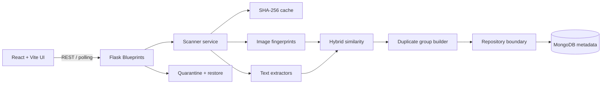

# DedupeIQ

**Find what looks the same, reads the same, and wastes your storage.**

DedupeIQ is a local-first duplicate file finder for personal storage. It combines deterministic hashing, perceptual image fingerprints, normalized document text, and explainable multi-signal similarity to surface logical duplicate groups before anything is moved or deleted.

> The current build includes a polished React/Vite product shell, demo workspace, browser folder upload path, Flask scan API, exact hashing, image/document candidate scoring, grouping, quarantine workflow, settings, scan history, and backend tests.

## Screenshots

Screenshots can be added here after running `npm run dev`:

- `docs/screenshots/overview.png` — dashboard and storage recovery overview
- `docs/screenshots/review.png` — explainable duplicate group review
- `docs/screenshots/scan.png` — live local scan workflow

## Architecture



The frontend is organized around routes, reusable UI primitives, query-backed data access, and domain types. The backend keeps discovery, extraction, similarity, grouping, and persistence concerns separate so the in-memory development store can be replaced by MongoDB without changing API handlers.

## Features

- Exact duplicate detection with SHA-256.
- Near-duplicate image detection with pHash, dHash, and aHash.
- TXT, PDF, DOCX, and PPTX text extraction and normalization.
- Hybrid document/image scoring with confidence bands and signal explanations.
- Connected duplicate groups with best-copy recommendations.
- Safe review → quarantine → restore/permanent deletion flow.
- Local-first privacy messaging and no third-party AI dependency.
- Responsive desktop-first shell with dark mode, keyboard-visible focus states, reduced-motion support, and compact mobile navigation.
- Demo workspace data for presentations without a large file corpus.

## Detection pipeline

1. Discover supported files recursively and collect metadata.
2. Calculate SHA-256 hashes; exact matches bypass expensive similarity work.
3. Generate cheap image or document fingerprints.
4. Compare only same-category candidates above configured thresholds.
5. Create explainable candidate groups and recommend a copy using quality/size/recency signals.
6. Expose progress through `GET /api/scans/:id/progress`.

The repository boundary is ready for MongoDB, embedding caches, and ANN retrieval such as FAISS. The lightweight build deliberately keeps model loading optional so a fresh install remains fast and local; a Sentence Transformers adapter can be added behind the similarity service for larger semantic corpora.

## Tech stack

- Frontend: React, TypeScript, Vite, Tailwind CSS, shadcn-style primitives, Lucide, Framer Motion, React Router, TanStack Query.
- Backend: Python, Flask, Flask Blueprints, Pydantic-ready service boundary, PyMongo-ready repository boundary.
- Analysis: Pillow, imagehash, PyMuPDF, python-docx, python-pptx, scikit-learn/numpy-ready environment.
- Storage: MongoDB metadata collections (`scans`, `files`, `duplicate_groups`, `similarity_results`, `user_actions`, `quarantine`, `settings`).

## Installation

### Frontend

```bash
npm install
npm run dev
```

The Vite dev server runs on `http://localhost:5173` and proxies `/api` to Flask on port `5000`.

### Backend

Create a Python 3.11+ environment, then:

```bash
cd backend
python -m venv .venv
\.venv\Scripts\activate       # Windows
source .venv/bin/activate      # macOS/Linux
pip install -r requirements.txt
python run.py
```

MongoDB is optional for the current development fallback. Set `MONGO_URI` and `MONGO_DB` when wiring the production `MongoStore` repository.

## Environment variables

| Variable | Default | Purpose |
| --- | --- | --- |
| `MONGO_URI` | `mongodb://localhost:27017` | MongoDB connection string |
| `MONGO_DB` | `dedupeiq` | Metadata database name |
| `DEDUPEIQ_DATA_DIR` | `.dedupeiq` | Temporary upload/quarantine metadata directory |
| `MAX_FILE_SIZE` | `2147483648` | Per-file safety limit |
| `IMAGE_THRESHOLD` | `0.85` | Minimum image candidate score |
| `DOCUMENT_THRESHOLD` | `0.80` | Minimum document candidate score |

## Production build

```bash
npm run build
```

Serve `dist/` from a static host and put Flask behind a same-origin reverse proxy. For a desktop wrapper, pass a validated server-side folder path to `POST /api/scans` with `{ "root_path": "..." }`; the browser upload path is intended for web-safe folder selection.

## Privacy and safety model

Analysis is designed to run locally. Metadata is stored rather than large file contents. The server validates scan roots and file records before filesystem operations. Review actions only mark files for quarantine; permanent deletion requires a separate explicit action. Corrupt or unsupported files are recorded as scan issues and do not abort a scan.

## Limitations

- The development store is process-local until the MongoDB repository is connected.
- Browser security prevents a web page from passing a user’s absolute local folder path; browser scans upload selected files to the local Flask process for analysis.
- Semantic embeddings and FAISS retrieval are intentionally adapter points rather than mandatory startup dependencies in this first production slice.
- Video/audio matching, OCR, NAS scanning, and multi-user accounts are future extensions.

## Tests

```bash
cd backend
pytest
```

The suite starts with deterministic hashing and core similarity confidence tests, and is structured to grow with scanner, safe filesystem, clustering, and API coverage.
